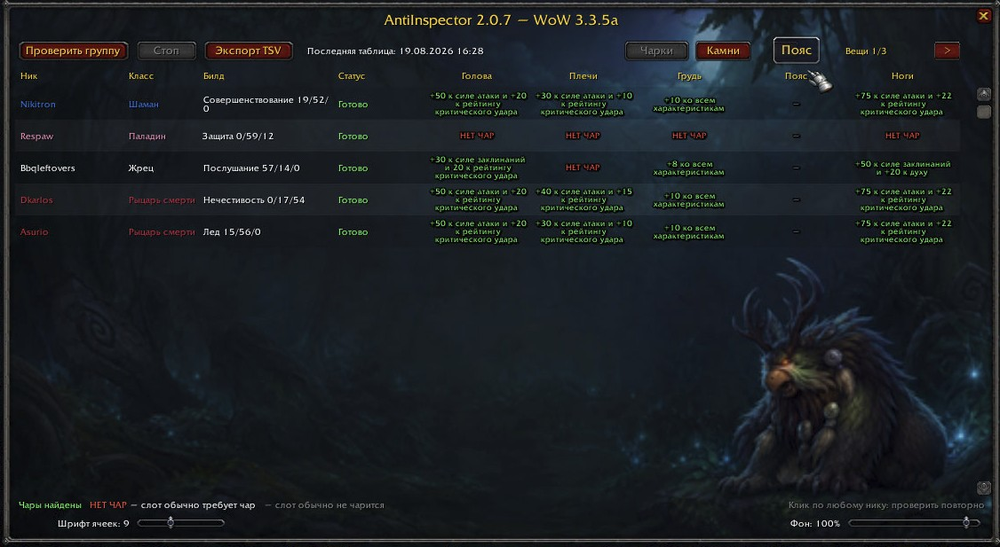

<div align="center">

# AntiInspector

**Manual enchant and gem auditing for parties and raids in World of Warcraft 3.3.5a**

Find missing enchants and empty sockets, rescan individual players,<br>
and move the results into Excel — all from one window.

<p>
  
  
  
  
</p>

<p>
  <a href="https://github.com/NikNorbert/AntiInspector-WotLK/archive/refs/tags/v2.0.7.zip"></a>
  <a href="RELEASE_NOTES_2.0.7_EN.md"></a>
</p>

[Русская документация](README_RU.md)

</div>



AntiInspector scans nearby group members through the standard WoW Inspect API and displays their character name, class, active talent build, equipment enchants, socket count, installed gems, and empty sockets. Results can be copied directly into Microsoft Excel as an English TSV table.

## Features

- Works in both parties and raids.
- Starts only when requested by the player; it never scans automatically.
- Scans the player immediately and inspects nearby group members one at a time.
- Shows character name, class, active talent tree, and talent point distribution.
- Separate **Enchants** and **Gems** tabs.
- Automatically follows the game client locale: `ruRU` uses a fully Russian interface, while English clients use an English interface.
- Detects missing enchants on normally enchantable equipment slots.
- Detects gem socket counts, installed gems, and empty sockets.
- Shows localized gem stat effects instead of gem item names and colors them by quality: bright purple for Epic, blue for Rare, green for Uncommon, and red for empty sockets.
- Provides a saved 8–11 point equipment-cell font slider that applies to both Enchants and Gems; gem effects use separate lines and duplicate-effect grouping such as `+20 Strength x3`.
- Recognizes additional sockets from Eternal Belt Buckle and profession bonuses.
- Allows any character to be rescanned by clicking their name after the group scan has finished, including characters whose first scan succeeded.
- Correctly treats an empty Off Hand as unavailable when a two-handed weapon is equipped in Main Hand.
- Draggable minimap button for opening and closing the addon window.
- Opaque moonlit moonkin artwork for the main window, with a saved 0–100% background-opacity slider.
- Uses a legacy-compatible uncompressed 32-bit 512x512 TGA loaded through a cache-safe texture path.
- Saves the most recent scan between `/reload` and game sessions.
- Excel-compatible TSV export with English class, build, status, enchant, and gem text.
- Enchant export writes `NONE` only for a confirmed missing enchant; equipment cells remain blank when a character could not be inspected.
- Includes 2,655 named enchant and gem-effect entries from the WoW 3.3.5a `SpellItemEnchantment.dbc` data.
- Optional Windows helper for creating timestamped `.tsv` and `.xlsx` files while the game is running.

## Installation

1. Extract the `AntiInspector` folder into:

   ```text
   World of Warcraft\Interface\AddOns\
   ```

2. Confirm that the addon file is located at:

   ```text
   World of Warcraft\Interface\AddOns\AntiInspector\AntiInspector.toc
   ```

3. Fully close and restart the game. A `/reload` may not discover a newly added
   texture file because the legacy client can cache rejected textures.

   For later Lua-only updates, you can run:

   ```text
   /reload
   ```

## Usage

Use the minimap button to open or close AntiInspector, or use one of the following commands:

```text
/enchinsp          Start a manual party or raid scan
/enchinsp scan     Start or restart a scan
/enchinsp show     Show the most recently saved table
/enchinsp stop     Stop the current scan
/enchinsp export   Open and select the TSV export text
/enchinsp clear    Delete the saved scan table
```

Short alias:

```text
/ai
```

Compatibility aliases `/rea` and `/raidcheck` are also supported.

## Scanning requirements

- You must be in a party or raid.
- Scanning must be started outside combat.
- Other characters must be online, visible to the client, and within Inspect range (approximately 30 yards).
- WoW 3.3.5a can inspect only one character at a time, so a full raid scan is not instantaneous.
- If the server does not send `INSPECT_TALENT_READY`, AntiInspector still attempts to read the equipment. The build may be displayed as unavailable.

Characters that cannot be inspected receive a separate status such as **Out of range**, **Offline**, **No response**, or **No data**.

## Rescanning one character

After the party or raid scan has finished, click any character name in the table to inspect only that character again. This works for successful scans as well as failed or incomplete scans.

The individual rescan requires the character to remain in the current party or raid, be within Inspect range, and the player to be outside combat.

## Enchant audit

The Enchants tab checks the equipment slots that normally support permanent enchants in WotLK:

- Head
- Shoulders
- Chest
- Legs
- Feet
- Wrists
- Hands
- Back
- Main Hand
- Off Hand when applicable

Neck, shirt, rings, trinkets, and tabard are excluded from the enchant report. If Main Hand contains a two-handed weapon, the empty Off Hand slot is shown as unavailable instead of being reported as missing an enchant.

## Gem audit

On a Russian client, the table displays localized Russian gem names returned by the game API. The TSV export still uses the addon's English effect database, so all exported headings and values remain English and Excel-safe.

The Gems tab checks every equipment category that can contain sockets in WotLK:

- Head, neck, shoulders, and chest
- Waist, legs, feet, wrists, and hands
- Rings and socketed Jewelcrafting trinkets
- Main Hand, Off Hand, and ranged weapon

Cloak, shirt, and tabard are excluded from the gem report. For every supported item, the export contains a `_SocketCount` column and a `_Gem` column, for example:

```text
SHOULDER_SocketCount
SHOULDER_Gem
```

Items without sockets are exported as `No sockets`. Unfilled sockets are exported as `EMPTY SOCKET`.

## Color legend

### Enchants

- **Green:** a permanent enchant was found.
- **Red:** a slot that normally requires an enchant has no permanent enchant.
- **Gray —:** the slot does not normally require an enchant or is unavailable.

### Gems

- **Green:** every detected socket is filled.
- **Red:** all detected sockets are empty.
- **Yellow:** only some detected sockets are filled.
- **Gray —:** the item has no sockets or the slot is unavailable.

## Exporting to Excel

1. Run `/enchinsp` and wait for the scan to finish.
2. Open the **Enchants** or **Gems** tab. The active tab determines which report is exported.
3. Click **Export TSV** or run `/enchinsp export`.
4. In the export window, press `Ctrl+A`, then `Ctrl+C`.
5. Select cell `A1` in Excel and press `Ctrl+V`.

The export intentionally uses English text. The WoW 3.3.5a client does not reliably transfer Cyrillic text through the Windows clipboard, while English output can be pasted into Excel without encoding corruption.

Technical `EnchantID`, `ItemID`, and `ClassFile` columns are not included in the report. Unknown entries are displayed as `Unknown enchant ID` or `Unknown gem effect ID` instead of a bare numeric value.

## Optional automatic file export

WoW addons cannot write arbitrary files to the Windows filesystem. AntiInspector therefore includes an optional external clipboard helper.

Before copying the export, run:

```text
Start_AntiInspector_Excel_Export.cmd
```

The helper monitors the clipboard and creates timestamped export files in:

```text
World of Warcraft\AntiInspector_Exports\
```

When Microsoft Excel is available, the helper creates both `.tsv` and `.xlsx` files. Otherwise, it still creates a UTF-8 `.tsv` file that Excel can open. `latest.tsv` and `latest.xlsx` point to the latest successful export.

The helper does not read game memory or modify the WoW client. It only processes text copied to the Windows clipboard.

## Limitations

- AntiInspector reports the enchants and gems that are present; it does not determine a character's exact Hit, Expertise, Armor Penetration, or Haste caps.
- Inspect results depend on server behavior, distance, visibility, and item data cached by the client.
- If a character moves away or the group composition changes during a scan, rescan that character after moving back into range.
- Profession-specific enchants and sockets are reported when they are visible in the inspected item data.

## Supported game version

- World of Warcraft 3.3.5a
- Interface number: `30300`
- Addon version: `2.0.7`
